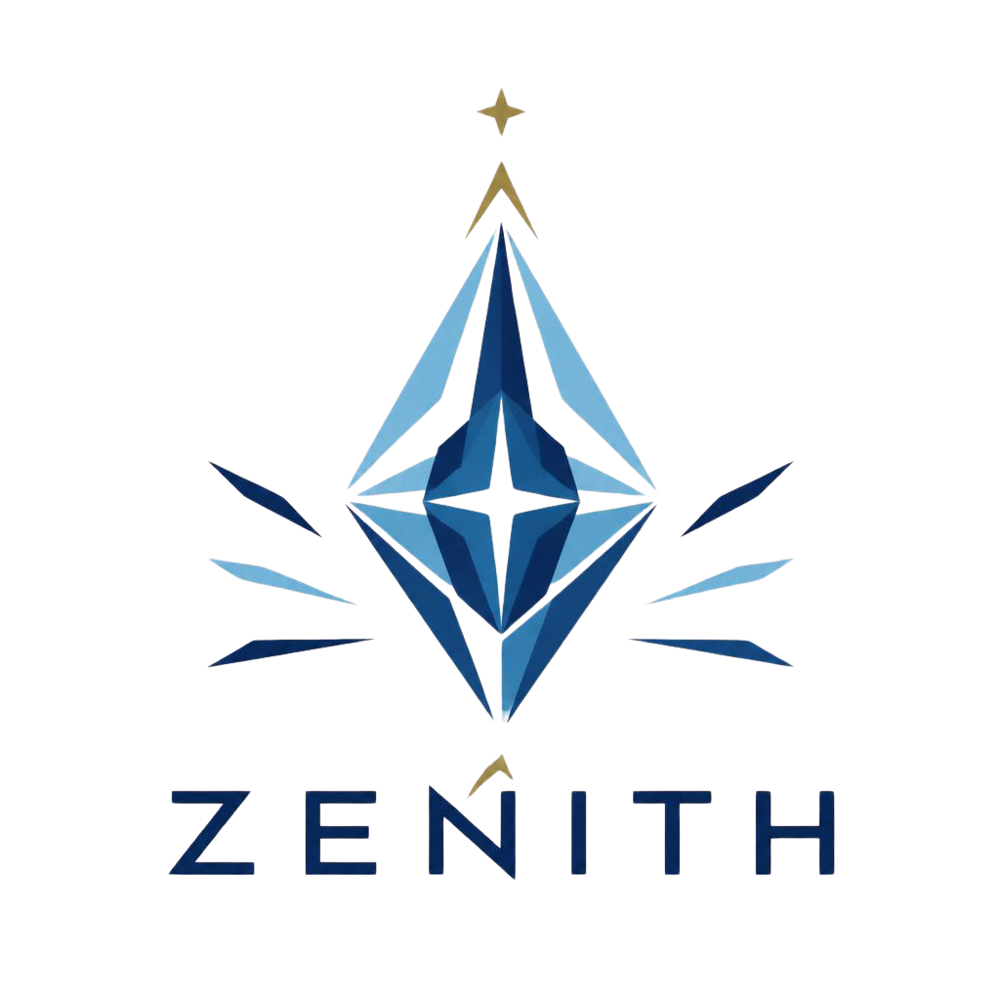
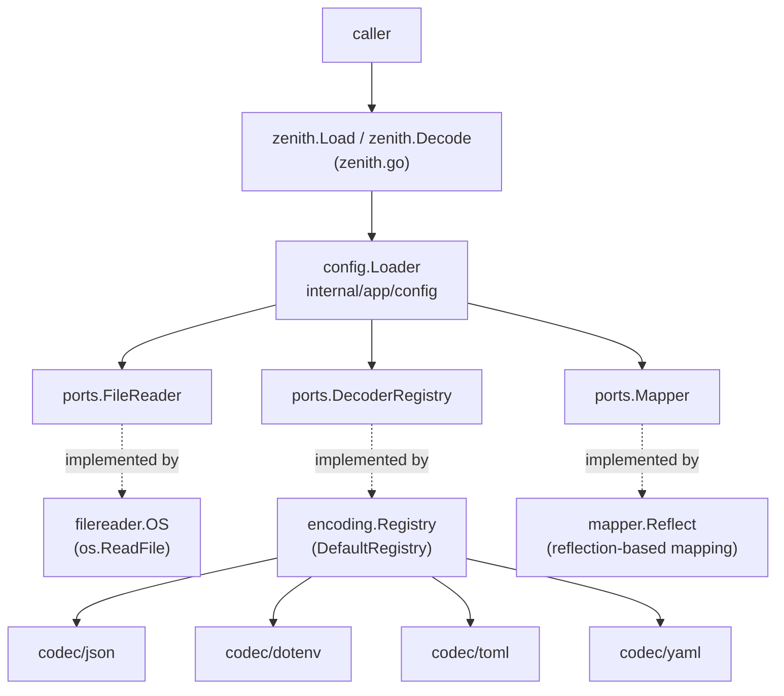
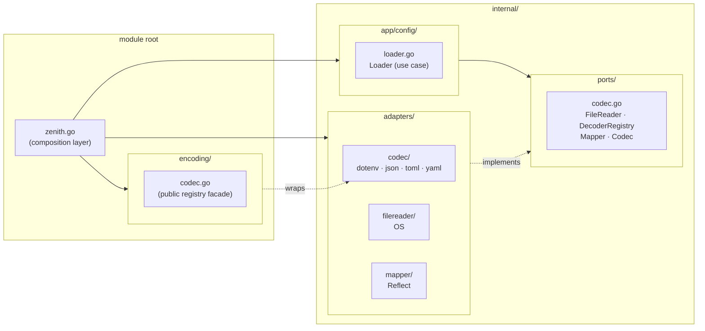
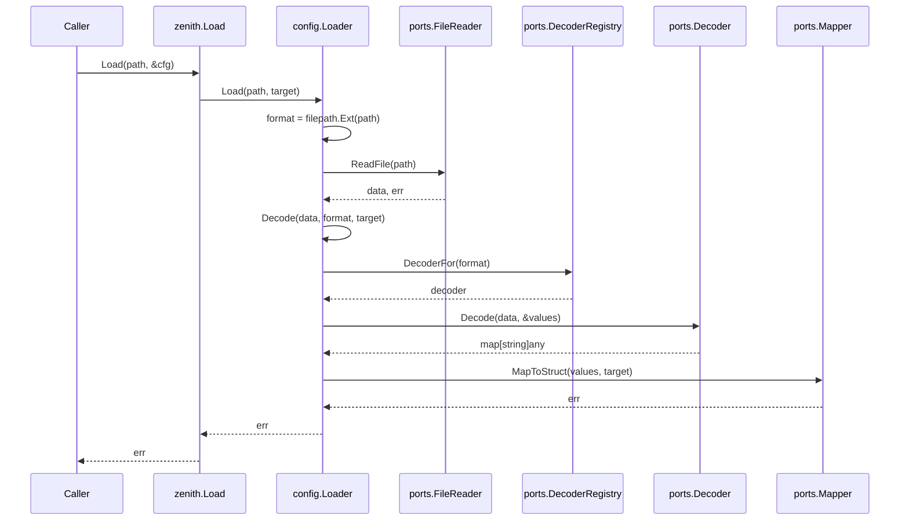

<div align="center">
    
    <br>
    <h1><strong>Zenith</strong></h1>
</div>


Zenith is a small Go configuration loader. It reads a config file, selects the correct decoder from the file extension, decodes the file into key-value data, and maps those values into a struct.

The package currently supports JSON, dotenv, YAML, and TOML files through the default registry.

## Installation

```
go get github.com/maneeshaindrachapa/zenith
```

## Quick Usage
### JSON Usage

Create a config file:

```json
{
  "name": "Zenith",
  "port": 8080,
  "enabled": true,
  "timeout": "5s"
}
```

Load it into a struct:

```go
package main

import (
	"log"
	"time"

	"github.com/maneeshaindrachapa/zenith"
)

type Config struct {
	Name    string        `json:"name"`
	Port    int           `json:"port"`
	Enabled bool          `json:"enabled"`
	Timeout time.Duration `json:"timeout"`
}

func main() {
	var cfg Config
	if err := zenith.Load("config.json", &cfg); err != nil {
		log.Fatal(err)
	}

	log.Printf("%+v", cfg)
}
```

You can also decode bytes directly when you already know the format:

```go
var cfg Config
err := zenith.Decode([]byte(`{"name":"Zenith","port":8080}`), "json", &cfg)
```

Strict mapping is available when unknown fields should fail fast:

```go
err := zenith.Load("config.json", &cfg, zenith.WithStrictMapping())
```

`Load` and `Decode` map into a non-nil pointer to a struct. They do not accept
`map[string]any` as a target. To read the complete decoded document without
struct mapping, use the public codec registry directly:

```go
package main

import (
    "fmt"
    "log"
    "os"

    "github.com/maneeshaindrachapa/zenith/encoding"
)

func main() {
    data, err := os.ReadFile("config.json")
    if err != nil {
        log.Fatal(err)
    }

    decoder, err := encoding.DecoderFor("json")
    if err != nil {
        log.Fatal(err)
    }

    values := make(map[string]any)
    if err := decoder.Decode(data, &values); err != nil {
        log.Fatal(err)
    }

    fmt.Printf("%#v\n", values)
}
```

For a file whose format is identified by its extension, get the extension
with `filepath.Ext(path)` and pass it to `encoding.DecoderFor`. The decoder
returns the whole top-level document as `map[string]any`; nested objects and
arrays remain nested maps and slices.

By default, an explicit empty string in config overwrites the existing struct value. To keep existing values when the config value is `""`, use:

```go
err := zenith.Load("config.json", &cfg, zenith.WithPreserveExistingOnEmpty())
```

### Dotenv Usage

```
NAME="Zenith"
PORT="8080"
ENABLED="true"
TIMEOUT="250ms"
```

```go
type Config struct {
	Name    string        `env:"NAME"`
	Port    int           `env:"PORT"`
	Enabled bool          `env:"ENABLED"`
	Timeout time.Duration `env:"TIMEOUT"`
}

var cfg Config
err := zenith.Load(".env", &cfg)
```

### Struct Mapping

Zenith maps decoded values into exported struct fields.

Supported tags:

- `zenith`
- `json`
- `env`
- `mapstructure`
- `default`
- `required`
- `validate`

Supported value types:

- `string`
- `bool`
- signed and unsigned integers
- floats
- `time.Duration`
- slices
- nested structs
- pointer fields
- fields implementing `encoding.TextUnmarshaler`

Field matching is normalized, so names such as `PORT`, `port`, `max_connections`, `max-connections`, and `MaxConnections` can map to the same field.

Fields tagged with `json:"-"`, `env:"-"`, `zenith:"-"`, or `mapstructure:"-"` are ignored.

Defaults and required values can be declared on fields:

```go
type Config struct {
	Name string `json:"name" required:"true"`
	Port int    `json:"port" default:"8080"`
	Mode string `json:"mode" validate:"required"`
}
```

Required fields can be written as `required:"true"`, `validate:"required"`, or as an option in the `zenith` tag. Defaults are applied only when the field is missing from the decoded config.

For full config validation, implement `Validate() error` on the target struct:

```go
func (c *Config) Validate() error {
	if c.Port <= 0 {
		return fmt.Errorf("port must be positive")
	}
	return nil
}
```

Mapping errors include nested paths, for example `database.max_connections`.

#### Field Checks and Conversion

Mapping is permissive about field names and common scalar representations, but
it still checks values before assigning them:

- Field names are matched case-insensitively after removing `_` and `-`.
- Values can be converted to strings, booleans, signed and unsigned integers,
    floats, `time.Duration`, and slices when the value is valid for the target
    type. Fractional values are not silently truncated into integers, and
    negative values are rejected for unsigned integers.
- Nested structs and slices are checked recursively. Conversion failures
    report the field path, such as `database.max_connections` or
    `hosts[1]`.
- Pointer fields are allocated when a value is present. Fields implementing
    `encoding.TextUnmarshaler` can perform their own validation.
- Exported fields are mapped. Unexported fields and fields tagged with `-`
    are ignored.

Use strict mapping when the configuration must not contain keys that are not
represented by the target struct. Strict checking is recursive and reports the
first unknown key in sorted order:

```go
type Config struct {
	Name string `json:"name"`
}

var cfg Config
err := zenith.Load("config.json", &cfg, zenith.WithStrictMapping())
if errors.Is(err, zenith.ErrUnknownField) {
	// A key such as "logging.level" was not represented by Config.
}
```

Strict mapping does not make fields required. Mark fields explicitly with
`required:"true"`, `validate:"required"`, or `zenith:",required"` when a
value must be present and non-empty. Defaults apply only when a field is
missing; they do not replace an explicitly supplied empty string.

### Error Handling

Zenith wraps package-originated failures with one structured error type, `ConfigError`, plus sentinel kinds so callers can use `errors.Is` and `errors.As`. Lower-level causes are preserved:

```go
err := zenith.Load("config.xml", &cfg)
if errors.Is(err, zenith.ErrUnsupportedFormat) {
	// no decoder is registered for this format
}
```

The exported sentinel kinds are:

- `ErrUnsupportedFormat`: no decoder is registered for the requested format.
- `ErrUnknownField`: strict mapping found a key with no matching struct field.
- `ErrRequiredField`: a required field is missing or empty.
- `ErrMissingExtension`: `Load` was given a path without a file extension.
- `ErrReadFile`: the file could not be read.
- `ErrEncode` and `ErrDecode`: encoding or decoding failed.
- `ErrInvalidTarget`: the target is not a non-nil pointer to a struct.
- `ErrInvalidValue`: a value cannot be converted or assigned to its field.
- `ErrValidation`: the target's `Validate() error` method returned an error.
- `ErrRegistry`: a codec registration request was invalid.

Strict mapping returns `ErrUnknownField` with the rejected field path:

```go
err := zenith.Load("config.json", &cfg, zenith.WithStrictMapping())

var configErr *zenith.ConfigError
if errors.As(err, &configErr) {
    log.Println(configErr.FieldPath())
}
```

Required fields return `ErrRequiredField`:

```go
var reasoned zenith.Reasoned
if errors.As(err, &reasoned) {
	log.Println(reasoned.ErrorReason())
}
```

`ConfigError` also exposes the error metadata through small interfaces:

- `zenith.Kinded` provides `ErrorKind()`.
- `zenith.FieldPathed` provides `FieldPath()`.
- `zenith.Formatted` provides `FormatName()`.
- `zenith.Reasoned` provides `ErrorReason()`.
- `zenith.Caused` provides `Cause()`.

When an underlying library or filesystem operation fails, `ConfigError.Cause()`
returns that lower-level error. You can inspect both the sentinel and the cause:

```go
err := zenith.Load("config.json", &cfg)
if err != nil {
    var configErr *zenith.ConfigError
    if errors.As(err, &configErr) {
        log.Printf("kind=%v path=%q format=%q reason=%q", configErr.ErrorKind(), configErr.FieldPath(), configErr.FormatName(), configErr.ErrorReason())
        if cause := configErr.Cause(); cause != nil {
            log.Printf("cause: %v", cause)
        }
    }
    log.Fatal(err)
}
```

## Supported Formats

Default registered formats:

- `json`
- `dotenv`
- `env`
- `yaml`
- `yml`
- `toml`

YAML and TOML are parsed with standards-compliant libraries and support the syntax defined by their respective formats.

You can inspect the current registry:

```go
formats := encoding.RegisteredFormats()
```

### Registering a Custom Codec

A codec implements both `Encode` and `Decode`:

```go
type Codec interface {
	Encode(map[string]any) ([]byte, error)
	Decode([]byte, *map[string]any) error
}
```

Register it by format name:

```go
import "github.com/maneeshaindrachapa/zenith/encoding"

err := encoding.Register("custom", MyCodec{})
```

After registration, `zenith.Load("config.custom", &cfg)` and `zenith.Decode(data, "custom", &cfg)` can use that codec.

## Architecture

Zenith follows a hexagonal architecture style, also called ports and adapters. The public API is intentionally thin, and the application service depends on interfaces, not concrete implementations. Concrete details live outside the application core as adapters.



### Layers



### How The Pieces Connect

`zenith.go` is the composition layer. It wires the default implementation together:

- `filereader.OS{}` reads files from disk.
- `encoding.DefaultRegistry()` finds decoders by format.
- `mapper.Reflect{}` maps decoded values into structs.
- `config.Loader` coordinates those ports.

`internal/ports` defines the boundaries:

- `FileReader` reads bytes from a path.
- `DecoderRegistry` returns a decoder for a format.
- `Decoder` parses bytes into `map[string]any`.
- `Mapper` maps decoded values into a struct.

`internal/app/config` contains the use case, shown here for `zenith.Load`:



`internal/adapters` contains implementations:

- Codec adapters handle format-specific parsing.
- The file reader adapter uses `os.ReadFile`.
- The mapper adapter uses reflection.

`encoding` is a public registry facade. It exposes codec registration and lookup while keeping concrete codec implementations under `internal/adapters`.

## Design Patterns Used

- Hexagonal Architecture: keeps application logic independent from IO, decoding, and reflection details.
- Ports and Adapters: ports define what the app needs; adapters provide how it is done.
- Facade: `zenith.Load`, `zenith.Decode`, and the `encoding` package provide simple public entry points.
- Registry: codecs are registered by format name, so the loader can choose the correct decoder dynamically.
- Dependency Inversion: the loader depends on interfaces from `internal/ports`, not concrete implementations.

## Development

Run all tests with package coverage:

```
make test
```

Generate a coverage profile and function-level coverage report:

```
make coverage
```

The coverage profile is written to `coverage.out`.
